# Article Saver App - Architecture Plan v2

## Project Overview

An app to send content to Kindle by processing URLs and emails, extracting content, and providing it as an RSS feed for KOReader consumption.

## Requirements

-   Endpoint that receives URLs and extracts HTML content
-   Email forwarding integration for newsletters without public URLs
-   Format content for KOReader consumption (HTML format)
-   Store processed content in database
-   Provide unified RSS feed
-   Personal use application
-   Future: Read status tracking

## Architecture Diagram

```mermaid
graph TB
    %% External Sources
    User[👤 User]
    Email[📧 Email Sender]
    Resend[📮 Resend.com]
    KOReader[📖 KOReader]

    %% API Layer
    API[🌐 FastAPI Server]

    %% Processing
    Processor[⚙️ Content Processor]
    Extractor[🔍 HTML Extractor]

    %% Storage
    DB[(🗄️ PostgreSQL)]

    %% Output
    RSS[📡 RSS Feed]

    %% User Interactions
    User -->|POST /submit URL| API
    Email -->|Forward email| Resend
    Resend -->|Webhook| API

    %% Processing Flow
    API -->|Queue content| Processor
    Processor -->|Extract & clean| Extractor
    Extractor -->|Sanitized HTML| Processor
    Processor -->|Store article| DB

    %% RSS Generation
    DB -->|Query articles| RSS
    RSS -->|Fetch feed| KOReader

    %% Read Status (Future)
    KOReader -.->|Mark as read| API
    API -.->|Update status| DB

    %% Styling
    classDef external fill:#e1f5fe
    classDef processing fill:#f3e5f5
    classDef storage fill:#e8f5e8
    classDef api fill:#fff3e0

    class User,Email,Resend,KOReader external
    class Processor,Extractor processing
    class DB storage
    class API,RSS api
```



## Core Components

### 1. Content Ingestion Layer

-   **REST API endpoint** for URL submission
-   **Email receiver** via Resend.com webhook integration
-   Input validation and rate limiting
-   Content type detection (URL vs email)

### 2. Content Processing Pipeline

-   **HTML extraction and cleaning** using readability algorithms
-   **Content sanitization** for Kindle/KOReader compatibility
-   **Metadata extraction** (title, author, date, source)
-   **Format standardization** to clean HTML
-   **Deduplication** using content hashing

### 3. Storage Layer

-   **PostgreSQL database** for structured data and full-text search
-   **Articles table**: id, title, author, source_url, content (HTML), created_at, read_status
-   **Sources table**: domain, source_type (url/email), processing_rules
-   Store full processed HTML content in database
-   Content compression for large articles

### 4. RSS Feed Generator

-   **Unified feed** with all content types
-   Include read/unread status in RSS metadata
-   Pagination support for large feeds
-   KOReader-compatible formatting

## Technology Stack

### Backend Framework

-   **FastAPI (Python)** - Excellent for content processing, async support, easy RSS generation

### Content Processing Libraries

-   **trafilatura** or **newspaper3k** - Article extraction
-   **beautifulsoup4** - Email HTML parsing
-   **nh3** - HTML sanitization - https://github.com/messense/nh3
-   **feedgen** - RSS feed generation

### Database

-   **PostgreSQL Supabase** - Full-text search, content storage, read status tracking

### Email Integration

-   **Resend.com** - Free tier, inbound email → webhook

### Additional Tools

-   **asyncio** - Async content fetching
-   **pydantic** - Data validation
-   **pytest** - Testing framework

## Database Schema

```sql
-- Articles table
CREATE TABLE articles (
    id SERIAL PRIMARY KEY,
    title VARCHAR(500) NOT NULL,
    author VARCHAR(200),
    source_url TEXT,
    source_type VARCHAR(20), -- 'url' or 'email'
    content TEXT NOT NULL,
    created_at TIMESTAMP DEFAULT NOW(),
    read_status BOOLEAN DEFAULT FALSE,
    content_hash VARCHAR(64), -- for deduplication
    metadata JSONB -- flexible additional data
);

-- Sources table for processing rules
CREATE TABLE sources (
    id SERIAL PRIMARY KEY,
    domain VARCHAR(255),
    source_type VARCHAR(20),
    processing_rules JSONB,
    created_at TIMESTAMP DEFAULT NOW()
);
```

## API Endpoints

### Core Endpoints

-   `POST /submit` - Submit URL for processing
-   `POST /webhook/email` - Resend.com webhook for email processing
-   `GET /rss` - RSS feed for KOReader
-   `GET /articles` - List articles (with filtering)

### Future Endpoints

-   `PUT /articles/{id}/read` - Mark article as read
-   `GET /rss/unread` - RSS feed with only unread articles

## Implementation Phases

### Phase 1: MVP (Core URL Processing)

-   [x] FastAPI server setup
-   [x] URL submission endpoint
-   [x] HTML extraction and cleaning
-   [x] PostgreSQL integration
-   [x] Basic RSS feed generation
-   [ ] KOReader integration testing

### Phase 2: Email Integration

-   [ ] Resend.com account setup
-   [ ] Email webhook endpoint
-   [ ] Email content extraction
-   [ ] Unified processing pipeline
-   [ ] Email forwarding testing

### Phase 3: Read Status Tracking

-   [ ] Read status database fields
-   [ ] Mark as read API endpoint
-   [ ] RSS feed filtering
-   [ ] KOReader integration for read status

### Phase 4: Polish & Advanced Features

-   [ ] Content deduplication
-   [ ] Better error handling
-   [ ] Monitoring and logging
-   [ ] Performance optimization
-   [ ] Content archiving

## Data Flow

1. **Content Input**:

    - User submits URL via API
    - Email forwarded to Resend → webhook → API

2. **Processing**:

    - Content queued for processing
    - HTML extracted and cleaned
    - Metadata extracted
    - Content sanitized for KOReader

3. **Storage**:

    - Article saved to PostgreSQL
    - Duplicate detection via content hash

4. **Consumption**:

    - RSS feed generated from database
    - KOReader fetches and displays content

5. **Future - Read Tracking**:
    - KOReader marks articles as read
    - Database updated with read status

## Deployment Considerations

### Development

-   Local PostgreSQL instance
-   Python virtual environment
-   Environment variables for configuration

### Production (Future)

-   Docker containerization
-   Cloud database (AWS RDS/Digital Ocean)
-   Cloud hosting (Railway, Fly.io, or VPS)
-   Environment-based configuration

## Security Considerations

-   Input validation and sanitization
-   Rate limiting on API endpoints
-   Content size limits
-   SQL injection prevention
-   XSS protection in stored content

## Monitoring & Maintenance

-   Logging for processing pipeline
-   Error tracking and alerting
-   Database performance monitoring
-   RSS feed health checks
-   Content processing metrics
